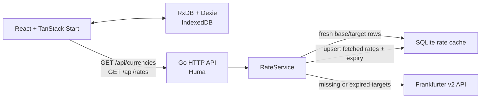

# Currency Watcher

A full-stack currency watchlist. Select currency pairs, keep them in the browser, and see the latest exchange rates from [Frankfurter](https://frankfurter.dev/). The API caches successful rates for one hour and returns each entry's expiry time; the UI schedules its next refresh from that value rather than polling on a fixed interval.

## What it does

- Loads Frankfurter's currently supported ISO currencies.
- Lets a user add and remove directed pairs such as `USD → EUR`.
- Persists the watchlist in the current browser.
- Groups watched targets by base currency and requests each group in one API call.
- Refreshes a group when its earliest returned rate expires; failed refreshes retry after 30 seconds.
- Exposes a small documented HTTP API, including OpenAPI JSON.

## Architecture



### Frontend

`frontend/` is a React 19 application built with Vite and TanStack Start. TanStack Router loads the currency catalog, TanStack Query owns remote API state, and `RateGroup` uses the returned `expiresAt` timestamps to determine when to refetch.

The watchlist is intentionally client-only: TanStack's `ClientOnly` boundary prevents server-side rendering from accessing browser storage. `frontend/src/stores/watchlist.ts` opens one RxDB database named `currencywatcher`, backed by Dexie/IndexedDB, with a `watchpairs` collection:

- Composite primary key: `base|target`, which makes an exact pair unique.
- Index: `[base, target]`.
- Live Mango query: sorted by base then target, so UI updates automatically after inserts and removals.

The generated TypeScript API client is in `frontend/src/lib/api/generated/`. It is generated from the local backend's OpenAPI document; application code wraps it in `frontend/src/lib/api/client.ts`.

### Backend

`backend/` is a Go HTTP service with a ports-and-adapters boundary:

- `internal/currency/` contains the `RateService`, domain models, and `RateProvider`/`RateStore` ports.
- `internal/adapters/frankfurter/` adapts the generated Frankfurter v2 client to `RateProvider` and rejects malformed, duplicate, or incomplete upstream responses.
- `internal/adapters/sqlite/` implements `RateStore` using GORM and SQLite.
- `internal/transport/httpapi/` exposes the service through Huma on the standard library `http.ServeMux`.
- `internal/server/` composes the provider, SQLite store, one-hour service TTL, routes, and CORS middleware.

The API validates three-uppercase-letter currency codes and unique, non-empty targets before the service is called.

### Rate-cache behavior

The backend cache is deliberately purpose-built for this single service instead of introducing Redis:

1. For a request, `RateService` asks SQLite for unexpired rows matching the requested base and targets.
2. It calls Frankfurter only for missing or expired targets.
3. It validates that every requested target was returned, assigns a one-hour expiry, and upserts just the newly fetched rows by `(base, target)`.
4. Concurrent requests for the same base plus unordered target set share one in-flight fetch.

SQLite is the cache's source of truth rather than a Go map. That provides persisted rows and database filtering for base/target lookups, while retaining the small in-process `inFlight` map solely for request coalescing. The adapter deliberately limits SQLite to one open connection, which is appropriate for its embedded single-process use.

This is a good fit for one API process and a compact rate cache. Redis becomes appropriate when the cache must be shared across multiple backend instances, independently operated, or needs broader cache-management features.

The frontend makes the parallel choice for user data: RxDB/IndexedDB replaces a `localStorage` blob with a validated collection, a composite key, an index, and queryable live updates. It is local to the browser profile; it is not synchronized across browsers or devices.

> **Deployment note:** the default cache path is `/tmp/currency-watcher/rates.db`. In the supplied container and ECS Express configuration it is an instance-local cache, so it may disappear when an instance is replaced or traffic is shifted to another task. This only causes a later upstream refresh; watched pairs remain browser-local.

## HTTP API

All routes are under `/api`.

| Method | Path                              | Purpose                                                              |
| ------ | --------------------------------- | -------------------------------------------------------------------- |
| `GET`  | `/health`                         | Liveness response: `{ "status": "ok" }`                              |
| `GET`  | `/currencies`                     | Frankfurter-supported currencies as `{ code, name }` objects         |
| `GET`  | `/rates?base=USD&targets=EUR,SGD` | Current cached-or-fetched rates for one base and one or more targets |
| `GET`  | `/openapi.json`                   | OpenAPI document used by the frontend generator                      |

A rates response has the following shape:

```json
{
  "base": "USD",
  "rates": {
    "EUR": {
      "rate": 0.85,
      "expiresAt": "2026-01-02T03:04:05Z"
    }
  }
}
```

## Run locally

### Prerequisites

- Go 1.25 or later
- Node.js 22 and Corepack/pnpm 11.23.0
- `curl` and `jq` only when regenerating the backend Frankfurter client
- [Task](https://taskfile.dev/) for the convenience commands below; otherwise use the direct commands

Install frontend dependencies once:

```sh
corepack enable
pnpm --dir frontend install
```

Start the two services in separate terminals:

```sh
# terminal 1
cd backend && go run ./cmd/server

# terminal 2
pnpm --dir frontend dev
```

Open `http://localhost:3000`. The frontend defaults to `http://localhost:8080` for the API.

With Task installed, `task dev` starts both development services. `task backend:dev` and `task frontend:dev` start either service individually.

### Configuration

#### Backend

| Variable               | Default                          | Meaning                                 |
| ---------------------- | -------------------------------- | --------------------------------------- |
| `PORT`                 | `8080`                           | HTTP listening port                     |
| `FRANKFURTER_BASE_URL` | `https://api.frankfurter.dev/v2` | Frankfurter v2 API base URL             |
| `RATE_CACHE_DB_PATH`   | `/tmp/currency-watcher/rates.db` | SQLite rate-cache database path         |
| `CORS_ALLOWED_ORIGINS` | `http://localhost:3000`          | Comma-separated allowed browser origins |

#### Frontend

| Variable            | Default                 | Meaning                                    |
| ------------------- | ----------------------- | ------------------------------------------ |
| `VITE_API_BASE_URL` | `http://localhost:8080` | API origin; Vite embeds this at build time |

For a separately hosted frontend, set `VITE_API_BASE_URL` to the backend origin during the frontend build and add the frontend origin to `CORS_ALLOWED_ORIGINS` on the backend.

## Generate API clients

The repository keeps generated clients under source control. Regenerate both after an API-contract change:

```sh
task generate
```

This downloads Frankfurter's OpenAPI contract for the Go adapter, starts a temporary local backend, then regenerates the TypeScript client from `/api/openapi.json`.

The equivalent focused commands are `task generate:backend` and `task generate:frontend`.

## Test, type-check, and build

```sh
go -C backend test ./...
pnpm --dir frontend typecheck
pnpm --dir frontend test
pnpm --dir frontend build
```

The frontend build first regenerates its API client, so the backend must be running at `VITE_API_BASE_URL` (default `http://localhost:8080`) when that command is run.

## Containers and deployment

Build and run the API container:

```sh
docker compose -f compose.backend.yml up --build
```

Build and preview the frontend container:

```sh
docker compose -f compose.frontend.yml up --build
```

`terraform/` provisions the backend on Amazon ECS Express Mode: an immutable ECR repository, CloudWatch log group, ECS task-execution and Express-infrastructure roles, and a GitHub Actions OIDC role. Express Mode manages the Fargate service, HTTPS Application Load Balancer, minimal service/load-balancer security groups, health checks at `/api/health`, canary deployments, and CPU-based scaling. It requires at least two public subnets in distinct Availability Zones; supply those as `public_subnet_ids`. The running task has no task role because the API has no AWS API permissions.

ECR images are immutable `sha-<Git commit>` tags. The first deployment has a deliberate bootstrap sequence: set `initial_image_tag` to the commit SHA that will be built, then run:

```sh
terraform -chdir=terraform init -upgrade
terraform -chdir=terraform apply \
  -target=aws_ecr_repository.app \
  -target=aws_ecr_lifecycle_policy.app \
  -target=aws_iam_openid_connect_provider.github \
  -target=aws_iam_role.github_actions
```

This targeted apply is only for image bootstrapping. Configure the GitHub repository variables `AWS_REGION`, `ECR_REPOSITORY` (`<app_name>-<environment>`), and `AWS_DEPLOY_ROLE_ARN` from `github_actions_role_arn`; run the workflow manually on that commit to publish its image; then run a full `terraform -chdir=terraform apply`. Set `ECS_EXPRESS_SERVICE_ARN` from `ecs_express_service_arn` afterward. Subsequent workflow runs push an immutable image revision, update only that Express service, and wait for its canary deployment to become active. Terraform ignores later image changes because the workflow owns image revisions.

The Terraform and workflow configuration do not provision or publish a frontend hosting service; use the frontend compose file or provide frontend hosting separately. Set its browser origin in `cors_allowed_origins` during the backend deployment.

## Project layout

```text
backend/
  cmd/server/                         process entry point
  internal/currency/                  domain service and ports
  internal/adapters/frankfurter/      upstream adapter and generated client
  internal/adapters/sqlite/           SQLite cache adapter
  internal/transport/httpapi/         Huma routes and CORS
  internal/server/                    dependency composition
frontend/
  src/components/dashboard/           watchlist UI and rate refresh behavior
  src/stores/watchlist.ts             RxDB/Dexie IndexedDB store
  src/lib/api/                        generated client and query wrappers
  src/routes/                         TanStack Start route
terraform/                            ECR, ECS Express, CloudWatch, and GitHub OIDC resources
.github/workflows/deploy.yml          validate, build, push, and deploy backend
```
